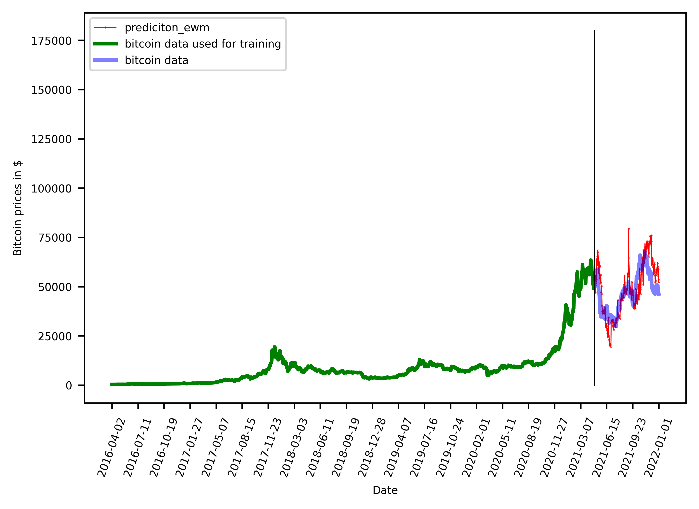

# Predicting-Bitcoin-prices-with-Social-Media-Google-Trends

 

* Cryptocurrency is a medium of exchange, just like the Indian Rupee, but is digital and uses encryption to control and verify the creation of monetary units and transfer of funds. With the Bitcoin market capitalization over 700 billion dollars, it is increasingly popular on platforms like Twitter which is used as a news source influencing purchase decision of its users.

* Predicting cryptocurrency price movements is a challenging task due to the highly stochastic nature of the market. Understanding impact of social media on cryptocurrency prices puts any trader in an advantageous position.

* **This paper puts forward a reasonably accurate method of predicting Bitcoin price changes using Google Trends, Tweet volume and sentiment analysis.**

Want the python code? Feel free to mail on aryan.tyagi.civ20@itbhu.ac.in
